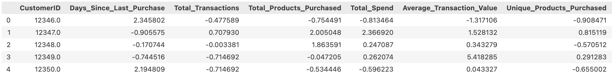
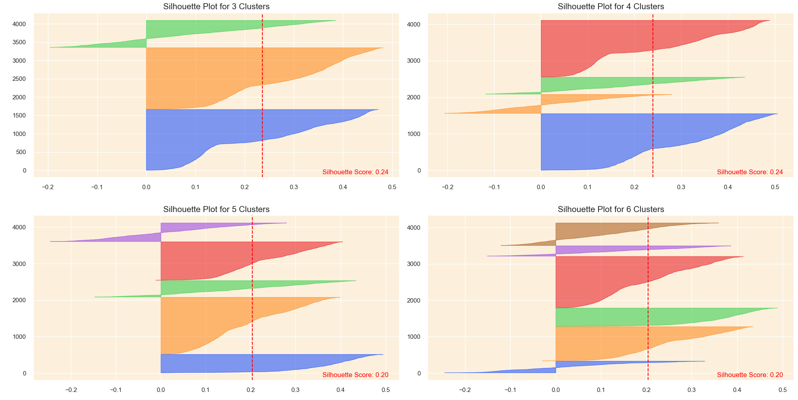

# Customer-Segmentation-and-Recommendation-for-Ecommerce

  

## Project problem and goal: 
In the competitive e-commerce landscape, customer segmentation is vital. It enables personalized marketing, enhances user experiences, and optimizes product offerings. By understanding and addressing the unique needs of different customer groups, it improves satisfaction, resource efficiency, and loyalty, ultimately driving profitability.

In this project, we aim to increase online retail sales by analyzing UK retail data from 2010-2011, using the [UCI Machine Learning data](https://archive.ics.uci.edu/dataset/352/online+retail). Our approach converts transaction data to a customer-centric model and employs K-means clustering for segmentation, identifying unique customer profiles. This informs a recommendation system that suggests popular products to customers in each segment who haven't purchased them. 

## About the dataset 
- Dataset: 541,909 records over 8 fields: InvoiceNo, StockCode, Description, Quantity, InvoiceDate, UnitPrice, CustomerID, Country.
- Quantity & UnitPrice: Average 9.55 and $4.61, respectively, with wide ranges indicating returns and outliers.
- CustomerID: Covers 406,829 entries, ranging from 12346 to 18287.
- InvoiceNo & StockCode: 25,900 unique invoices, 4,070 unique codes. Most frequent: Invoice 573585, StockCode 85123A.
- Description: 4,223 types, top being "WHITE HANGING HEART T-LIGHT HOLDER."
- Country: 38 countries, 91.4% of transactions from the UK.

## Structure of the Analysis:
1. **Cleaning data**: involves addressing missing values, removing duplicates and cancelled transactions, correcting anomalies
2. **Feature engineering**:
     - **RFM analysis**:
       - Recency (R): How recently a customer purchased. Lower values suggest higher engagement.
       - Frequency (F): How often a customer purchases. Higher values indicate loyalty.
       - Monetary (M): Total amount spent. Higher values mean greater contribution.
     - **Product diversity**: Explore purchase diversity for personalized strategies; use "Unique Products Purchased" for segmentation and tailored recommendations.
     - **Behavioral features**: Introduce "Average Days Between Purchases", "Favorite Shopping Day", "Favorite Shopping Hour"
     - **Geographic features**: Introduce "Country" feature for regional buying patterns and logistics optimization, with binary UK transactions aiding clustering, especially with K-means.
     - **Cancellation insights**: Introduce "Cancellation Rate" to reveal dissatisfaction trends
     - **Seasonality and Trends**: Introduce Monthly_Spending_Mean, Monthly_Spending_Std, Spending_Trend
3. **Detect and handle outliners**: using Isolation Forest algorithm -> About 5% of customers were flagged as outliers -> separate the outliers for analysis and remove them from the main dataset
4. **Feature scaling**
5. **Correlation analysis**
6. **Dimensionality Reduction**: using PCA
7. **K-means clustering**: Find the optimal number of clusters using the Elbow and Silhouette methods, then apply K-means
8. **K-means evaluation**: Utilize silhouette, calinski-harabasz, and davies-bouldin scores
9. **Cluster analysis and Profiling**: Analyze cluster characteristics to discern unique customer behaviors and preferences.
10. **Recommendation**: Create a recommendation engine suggesting 3 popular yet unpurchased products per customer cluster

## Results and Visualizations
### **New customer_data Ready for Modeling:** 
After cleaning, feature engineering, scaling, and outlier handling, we have new_customer_data being ready for modeling

Sample data:

  

### **Correlation:** 
Evaluating multicollinearity before KMeans clustering is crucial. Techniques like PCA can help address this issue by transforming correlated features.

The heatmap reveals several pairs of variables with high correlations, suggesting multicollinearity.

  

  
### **Dimensionality Reduction:** 
Evaluating multicollinearity before KMeans is crucial. PCA can address this by transforming correlated features.

  - **Plot cumulative variance to find optimal components**. With 6 components capturing 81% of variance, balancing preservation and reduction.

  

  - **Fitting and transforming original data into new PCA dataframe**

  

### **KMeans Clustering:** 
Find the opimal number of k clusters, using: Elbow Method, Sihouette Method

**Elbow Method:**
      The Elbow method suggests k=5 as optimal, but real-world data may vary, so k could range from 3 to 7. Refinement with silhouette will aid in determining a practical k value.

  

**Sihouette Method:**
    The Sihouette plot suggest that k=3 optimizes cluster balance and definition, enhancing solution reliability.
    

  

### **KMeans Evaluation:** 

- **3D Visualization of Customer Clusters in PCA Space:**

  

- **Evaluation metrics:**
Overall, metrics indicate good cluster quality, with room for optimization using alternative techniques.
    - Silhouette Score: ~0.236 indicates fair cluster separation, with some overlap.
    - Calinski Harabasz Score: 1257.17 suggests well-defined clusters.
    - Davies Bouldin Score: 1.37 shows moderate cluster similarity.

  

### **Cluster analysis and Profiling:** 
Analyze each cluster's characteristics to discern unique behaviors and preferences among customer segments:

Below are sample plots:

  

Characteristics of each cluster:

**Cluster 0 - Casual Weekend Shoppers:**
- Less frequent shopping with lower spending.
- Stable monthly spending, prefer weekends, and fewer product purchases.

**Cluster 1 - Occasional Big Spenders:**
- Shop infrequently but make large purchases.
- Increasing spending pattern, mainly UK based, shop post-work hours, and higher transaction cancellations.

**Cluster 2 - Eager Early-Bird Shoppers:**
- High spenders with varied purchases.
- Shop early, high spending variability, and a recent downtrend in spending.

### **Recommendation:** 

The goal is to create a recommendation engine suggesting three top products not yet purchased by a customer but popular within their cluster, catering to the primary 95% of customers. For the 5% outliers, random product recommendations will engage them.

Sample output:
Below are sample plots:

  

## Files and Directories:
- README.md: Contains the project description.
- images/: Directory containing all images and visualization files.
- Customer_Segmentation_code.ipynb: Jupyter Notebook with project code.

## Authors:
- Yen Phan

